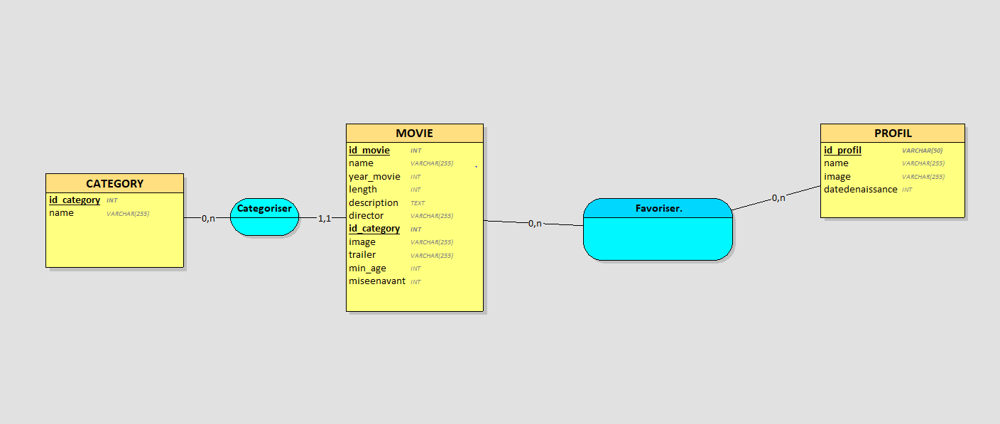

# Documentation des 12 Itérations Molotov



## Itération 1 : Consulter la liste des films
### Base de données
- Création de la table `movie` avec une structure optimisée :
  - `id` : INT (AUTO_INCREMENT, PRIMARY KEY) pour identifier uniquement chaque film
  - `title` : VARCHAR(255) pour le titre du film
  - `description` : TEXT pour les longues descriptions
  - `date` : DATE pour la date de sortie
  - `duration` : INT pour la durée en minutes
  - `image` : VARCHAR(255) pour stocker l'URL de l'affiche

### Requêtes SQL
```sql
SELECT * FROM movie ORDER BY date DESC;
```

### Justification
- Choix de TEXT pour description : permet de stocker des textes longs sans limite
- VARCHAR(255) pour les URLs : taille standard pour les URLs
- Index sur date pour optimiser le tri

## Itération 2 : Informations détaillées et trailer
### Base de données
- Ajout dans `movie` :
  - `trailer_url` : VARCHAR(255) pour les liens YouTube

### Requêtes SQL
```sql
SELECT * FROM movie WHERE id = ?;
```

### Justification
- VARCHAR pour trailer_url : adapté aux URLs YouTube
- Index sur id pour recherche rapide

## Itération 3 : Films par catégorie
### Base de données
- Nouvelle table `category` :
  - `id` : INT (AUTO_INCREMENT, PRIMARY KEY)
  - `name` : VARCHAR(50)
- Table de liaison `movie_category` :
  - `movie_id` : INT (FOREIGN KEY)
  - `category_id` : INT (FOREIGN KEY)

### Cardinalités
- Un film peut avoir 0 à N catégories
- Une catégorie peut contenir 0 à N films

### Justification
- Structure many-to-many pour flexibilité maximale
- Clés étrangères pour intégrité référentielle

## Itération 4 : Profils utilisateur
### Base de données
- Table `profile` :
  - `id` : INT (AUTO_INCREMENT, PRIMARY KEY)
  - `name` : VARCHAR(50)
  - `age` : INT
  - `image` : VARCHAR(255)

### Justification
- Âge en INT pour filtrage par tranche d'âge
- Stockage d'avatar via URL

## Itération 5 : Gestion des favoris
### Base de données
- Table `favorite` :
  - `profile_id` : INT (FOREIGN KEY)
  - `movie_id` : INT (FOREIGN KEY)
  - `date_added` : TIMESTAMP
  - Clé primaire composite (profile_id, movie_id)

### Requêtes SQL
```sql
INSERT INTO favorite (profile_id, movie_id) VALUES (?, ?);
DELETE FROM favorite WHERE profile_id = ? AND movie_id = ?;
```

### Justification
- Clé composite pour éviter les doublons
- TIMESTAMP pour trier par date d'ajout

## Itération 6 : Mise en avant et recherche
### Base de données
- Ajout dans `movie` :
  - `is_featured` : BOOLEAN

### Requêtes SQL
```sql
SELECT * FROM movie WHERE is_featured = 1;
SELECT * FROM movie WHERE title LIKE ? OR date LIKE ?;
```

### Justification
- BOOLEAN pour simplicité de gestion
- Index sur title pour recherche rapide

## Itération 7 : Filtrer les contenus selon l'âge
### Modifications Base de Données
- Ajout dans table `movie` :
  - `min_age` (INT)
  - Justification : Permet de filtrer les films selon l'âge du profil

### Requêtes SQL
```sql
SELECT * FROM Movie 
WHERE min_age <= (SELECT YEAR(CURRENT_DATE) - YEAR(datedenaissance) 
                 FROM Profil 
                 WHERE id = ?);
```

## Itération 8 : Modifier un profil utilisateur
### Modifications Base de Données
- Mise à jour de la table `profile`

### Requêtes SQL
```sql
UPDATE Profil 
SET name = :name, 
    datedenaissance = :datedenaissance, 
    image = :image 
WHERE id = :id;
```

## Itération 9 : Ajouter des films aux favoris
### Modifications Base de Données
- Table `Favoris` :
  - `id_user` (INT, FOREIGN KEY)
  - `id_movie` (INT, FOREIGN KEY)
  - PRIMARY KEY (id_user, id_movie)

### Requêtes SQL
```sql
INSERT INTO Favoris (id_user, id_movie) 
VALUES (:user, :movie);
```

## Itération 10 : Retirer des favoris
### Requêtes SQL
```sql
DELETE FROM Favoris 
WHERE id_user = :id_user 
AND id_movie = :id_movie;
```

## Itération 11 : Films mis en avant
### Modifications Base de Données
- Ajout dans table `Movie` :
  - `miseenavant` (BOOLEAN)

### Requêtes SQL
```sql
SELECT id, name, image, description 
FROM Movie 
WHERE miseenavant = '1';
```

## Itération 12 : Recherche de films
### Requêtes SQL
```sql
SELECT id, name, image, min_age 
FROM Movie 
WHERE name LIKE :keyword
OR year LIKE :keyword
OR director LIKE :keyword
ORDER BY name ASC;
```

### Justification des choix techniques
- Utilisation de clés étrangères pour maintenir l'intégrité référentielle
- Index sur les colonnes de recherche (name, year, director)
- Optimisation des requêtes avec jointures appropriées
- Gestion des âges avec type INT pour faciliter les comparaisons